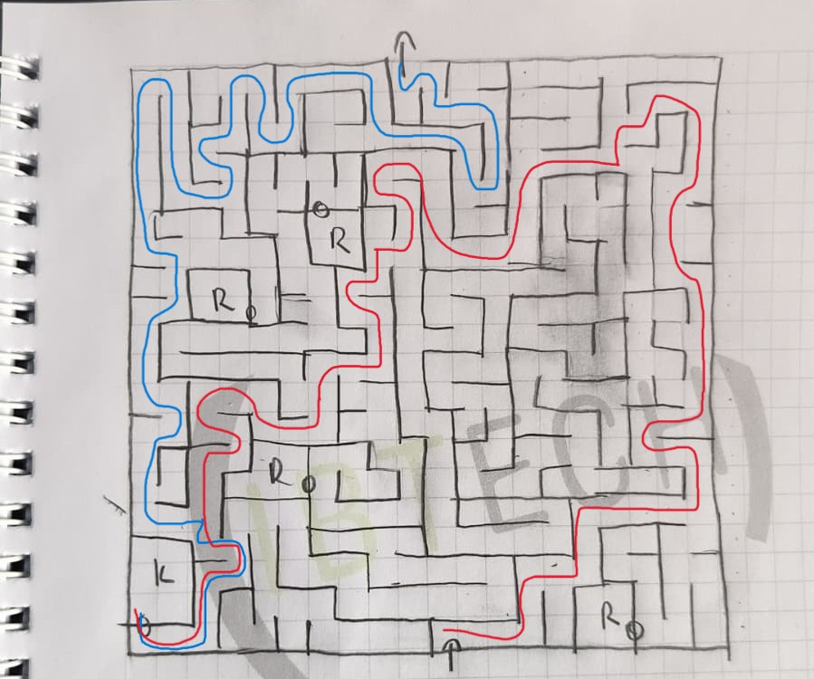

# Game Mechanics Documentation

## Overview
This game is a simple stealth and trap-based puzzle adventure. The player must navigate through a dangerous environment, avoid guards and traps, find the key, and bring it to the door in order to escape and win the game.

## Player
The player is controlled in third-person view.

### Player abilities
- Move using keyboard controls
- Control the camera with the mouse
- Push the key around
- Pick up and hold the key by looking at it and pressing `E`

### Player failure
The player loses if:
- A guard detects the player
- The player is hit by a trap such as arrows or the swinging trunk

---

## Key Object
The key is an important interactive object required to finish the game.

### Key mechanics
- The key can be pushed by the player
- The key can be picked up when the player is looking at it and presses `E`
- The key can be dropped by pressing `E` again
- The key is used to activate the door

---

## Door Object
The door is the final objective of the level.

### Door mechanics
- The door starts in a closed state
- When the key reaches the door, the door opening animation is triggered
- Two seconds after the animation starts, the player wins the game

### Winning condition
The player wins when:
- The key reaches the door
- The door opens successfully
- The win screen appears

---

## Guards
Guards patrol between specific points in the map.

### Guard mechanics
- Guards move back and forth along a path using coroutines
- Guards switch between idle and walking animations
- Guards detect the player if:
  - the player is close enough
  - the player is inside the guard’s field of view
  - there is no wall between the guard and the player

If all conditions are met, the player loses.

---

## Traps

### Swinging trunk
The swinging trunk acts as a moving obstacle.

- It swings continuously using a coroutine
- If the player collides with it, the player loses
- It also physically blocks the player’s movement

---

## Game End UI
When the game ends, a simple GUI appears.

### On win
- "YOU WIN" is displayed
- The player can choose:
  - **Restart**
  - **Quit**

### On loss
- "YOU LOSE" is displayed
- The player can choose:
  - **Restart**
  - **Quit**

When the game ends:
- player movement stops
- camera control stops
- the mouse cursor becomes visible

---

## Game World Rules
- The player must explore the level carefully
- Guards and traps must be avoided
- The key must be brought to the door
- The environment may contain walls that block guard vision
- Timing and positioning are important for survival

## Objective
Find the key, survive the traps and guards, unlock the door, and escape the level.

## Final Notes
- Maze layout can be found here

    - The player starts from the bottom and should go to the top with the key.
    - __R:__ room
    - __K:__ key room
    - __Red Path:__ Path from start to key.
    - __Blue Path__: Path from key to end. 
- The decorations inside the maze also show the way to the key and maze.